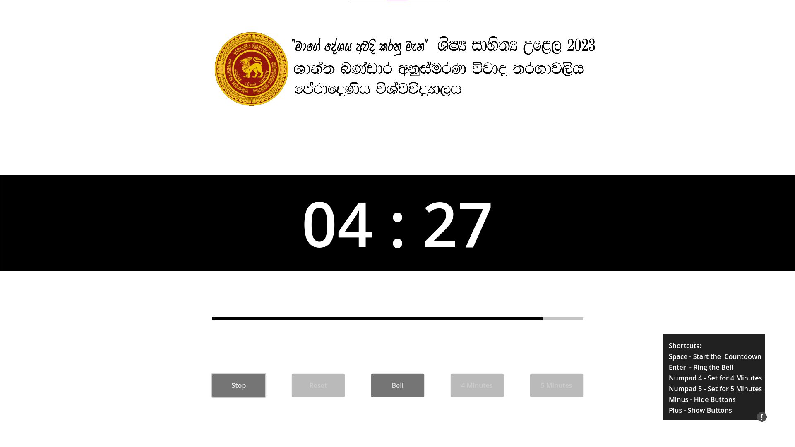

# Godot-Countdown-Timer-App

> Check out: 
[KivyMD-Countdown-Timer-App](https://github.com/IsiraUdaththa/KivyMD-Countdown-Timer-App)

The Godot Countdown Timer App created using the Godot game engine and GDScript. This project was developed as part of a debate competition organized by the University of Peradeniya.

## Features

- Set a countdown time as 4min and 5min.
- Start, pause, and reset the timer.
- Audible alerts when the timer expires.
- Visual slide bar.
- Shortcuts
- User-friendly interface.

## Technologies Used

- Godot Game Engine
- GDScript: A scripting language designed for use with the Godot engine.

## Screenshots

## Contributing

If you would like to contribute to this project, please follow these steps:

1. Fork the repository.
2. Create a new branch for your feature or bug fix.
3. Make your changes and commit them.
4. Open a pull request describing your changes.
